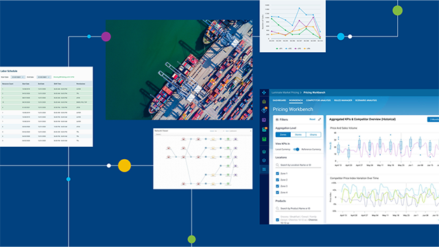

# Effective, efficient, end-to-end supply chains

Predict disruptions and course correct in real time with end-to-end visibility and AI-enhanced planning and execution that turns your supply chain into a growth driver.

<a href="#the-age-of-uncertainty" class="button secondary">The age of uncertainty</a> <a href="#its-time-to-evolve" class="button secondary">It's time to evolve</a> <a href="#why-with-blue-yonder" class="button primary">Why with Blue Yonder?</a>

***

## Thrive in an age of supply chain uncertainty

### End-to-end planning, execution and collaboration on one data cloud


{% column width="33.33333333333333%" %}
#### Dynamic customers have high expectations

Today's customers expect to buy what they want, when they want, through the channel they prefer, and at the best price.


{% column width="33.33333333333333%" %}
#### Disconnected stakeholders operate inefficiently

Supply chain decision makers operate in silos, hindered by manual processes and delayed collaboration.


{% column width="33.33333333333333%" %}
#### Disparate systems hinder instead of help

Legacy systems are isolated and inflexible. Real-time insight and action now determine success or failure.




{% column width="50%" %}
## $1.6 trillion

worth of inventory wasted each year across industries.


{% column width="50%" %}
## 70%

of digital transformation projects fail.



***

## The new era of supply chain management

### Modernize your supply chain from end to end

<table data-view="cards" data-card-size="large"><thead><tr><th></th><th></th><th></th><th data-hidden data-card-cover data-type="image">Cover image</th><th data-hidden data-card-target data-type="content-ref"></th></tr></thead><tbody>
<tr><td><h4><i class="fa-eye" style="color:$primary;"></i> <strong>Attain complete end-to-end supply chain visibility</strong></h4></td><td>Integrate data, plans, and insights so cross-functional teams can make accurate decisions, increase resilience, and minimize waste.</td><td><a href="https://app.gitbook.com/s/H7GIqXk9SW38FaGyX3Mc/foundation/data-cloud.md" class="button secondary">See the foundation</a></td><td><a href="../assets/why-blue-yonder-text-slider-01.png">../assets/why-blue-yonder-text-slider-01.png</a></td><td><a href="https://app.gitbook.com/s/H7GIqXk9SW38FaGyX3Mc/foundation/data-cloud.md">data-cloud</a></td></tr>
<tr><td><h4><i class="fa-wand-magic-sparkles" style="color:$primary;"></i> <strong>Provide insightful predictions to cope with rapid changes</strong></h4></td><td>Use what-if scenarios, deep data, and AI to anticipate risk and prepare corrective action before service or cost are affected.</td><td><a href="https://app.gitbook.com/s/H7GIqXk9SW38FaGyX3Mc/ai-decisioning/agentic-supply-chain.md" class="button secondary">See the intelligence</a></td><td><a href="../assets/why-blue-yonder-text-slider-02.png">../assets/why-blue-yonder-text-slider-02.png</a></td><td><a href="https://app.gitbook.com/s/H7GIqXk9SW38FaGyX3Mc/ai-decisioning/agentic-supply-chain.md">agentic-supply-chain</a></td></tr>
<tr><td><h4><i class="fa-cloud" style="color:$primary;"></i> <strong>Rely on a single source of truth to support complex operations</strong></h4></td><td>Connect data and processes across the organization through a common cloud platform for real-time collaboration.</td><td><a href="https://app.gitbook.com/s/Q6IxysMabsFnjb1ftdzp/workflows/exception-management.md" class="button secondary">See operations</a></td><td><a href="../assets/why-blue-yonder-text-slider-03.png">../assets/why-blue-yonder-text-slider-03.png</a></td><td><a href="https://app.gitbook.com/s/Q6IxysMabsFnjb1ftdzp/workflows/exception-management.md">exception-management</a></td></tr>
</tbody></table>

***

## Supply chain reinvention starts with Blue Yonder

### Blue Yonder provides a proven path to digital transformation


{% column width="50%" %}

### Adopt new business processes on your path, at your pace

Blue Yonder Composable Journeys provide a personalized implementation and upgrade path so teams can transform at their own pace while avoiding disruption.

<a href="https://app.gitbook.com/s/Q6IxysMabsFnjb1ftdzp/workflows/go-live-checklist.md" class="button secondary">See how it works</a>


{% column width="50%" %}

### Connect every action across your supply chain to a single source of truth

End-to-end transparency helps teams understand how work flows across planning, execution, commerce, partners, and operations.

<a href="https://app.gitbook.com/s/H7GIqXk9SW38FaGyX3Mc/foundation/data-cloud.md" class="button secondary">See what's possible</a>




{% column width="50%" %}

### Drive better decisions from AI and ML powered insights

AI assistants help forecast demand, identify disruptions, and prepare for adverse events as the system learns from new data.

<a href="https://app.gitbook.com/s/H7GIqXk9SW38FaGyX3Mc/ai-decisioning/decision-orchestration.md" class="button secondary">See the intelligence</a>


{% column width="50%" %}

### Unlock productivity with a true end-to-end supply chain

Solutions for every step in the supply chain, from planning to execution to commerce across the network, connected to one data cloud.

<a href="https://app.gitbook.com/s/Q6IxysMabsFnjb1ftdzp/" class="button secondary">Discover interoperability</a>



***

## The world's most trusted partner

### Join 3,000+ customers already benefiting

<table data-view="cards"><thead><tr><th></th><th></th><th></th><th data-hidden data-card-target data-type="content-ref"></th></tr></thead><tbody>
<tr><td><h4><i class="fa-truck-fast" style="color:$primary;"></i></h4></td><td><strong>DHL</strong></td><td>Transportation optimization and network design story.</td><td><a href="https://blueyonder.com/customers">customers</a></td></tr>
<tr><td><h4><i class="fa-industry" style="color:$primary;"></i></h4></td><td><strong>Carlsberg Group</strong></td><td>Digital-first transformation using transportation management.</td><td><a href="https://blueyonder.com/customers">customers</a></td></tr>
<tr><td><h4><i class="fa-bag-shopping" style="color:$primary;"></i></h4></td><td><strong>Walgreens</strong></td><td>AI-based order management behind fast customer promises.</td><td><a href="https://blueyonder.com/customers">customers</a></td></tr>
</tbody></table>

## Adored by brands, recognized by analysts

Blue Yonder has been named a Leader in three Gartner Magic Quadrant reports.

***

## Blue Yonder HUB demo paths

<table data-view="cards"><thead><tr><th></th><th></th><th></th><th data-hidden data-card-target data-type="content-ref"></th></tr></thead><tbody>
<tr><td><h3><i class="fa-brain-circuit" style="color:$primary;"></i></h3></td><td><strong>Platform & AI</strong></td><td>Agentic supply chain, common data cloud, extensibility, and decision orchestration.</td><td><a href="https://app.gitbook.com/s/H7GIqXk9SW38FaGyX3Mc/">platform-ai</a></td></tr>
<tr><td><h3><i class="fa-route" style="color:$primary;"></i></h3></td><td><strong>Planning & Execution</strong></td><td>Planning, warehouse, transportation, inventory, and exception workflows.</td><td><a href="https://app.gitbook.com/s/LcqiTNteUHkzjiTOUr8c/">planning-execution</a></td></tr>
<tr><td><h3><i class="fa-plug" style="color:$primary;"></i></h3></td><td><strong>Connect & Partners</strong></td><td>Developer routes, partner onboarding, certification, release notes, and support.</td><td><a href="https://app.gitbook.com/s/EBF0LyiZSa2gJV3j6pkd/">connect-partners</a></td></tr>
<tr><td><h3><i class="fa-life-ring" style="color:$primary;"></i></h3></td><td><strong>Help Center</strong></td><td>Common questions, escalation paths, and answer quality guidance.</td><td><a href="https://app.gitbook.com/s/m3QbZzRKTUSYEJM3D4oQ/">help-center</a></td></tr>
</tbody></table>


This page now mirrors the public Why Blue Yonder marketing page more closely: hero, anchor-style journey, uncertainty section, modernization blocks, proven-path visuals, customer proof, analyst recognition, then the GitBook demo navigation.

